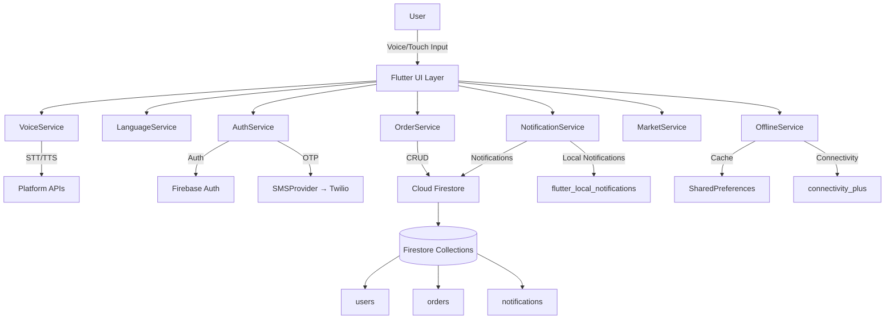

# AgriTrade App — Comprehensive B.Tech Project Report

**Author:** <Your Name>  
**Roll No:** <Your Roll No>  
**Department:** <Your Department/College>  
**Guide:** <Guide Name>  
**Date:** <Month Year>

---

## Abstract

This document presents the complete design, architecture, and implementation details of **AgriTrade**, a mobile application built with Flutter that connects farmers and retailers in the agricultural supply chain. The app prioritizes accessibility for first-time smartphone users, featuring voice-first interactions (speech-to-text and text-to-speech), multilingual support (English and Telugu), and offline-capable functionality. The backend uses Firebase for authentication and data storage, with Provider for app-wide state management. The system enables farmers to create crop sale orders through voice or manual input, and retailers to browse, analyze, accept/reject orders, and manage inventory with real-time analytics and market insights.

---

## Table of Contents

1. [Introduction](#1-introduction)
2. [System Overview](#2-system-overview)
3. [Architecture & Design](#3-architecture--design)
4. [Technology Stack](#4-technology-stack)
5. [Core Modules & Services](#5-core-modules--services)
6. [Data Models & Database Schema](#6-data-models--database-schema)
7. [User Flows & Screen Navigation](#7-user-flows--screen-navigation)
8. [Implementation Details](#8-implementation-details)
9. [Security & Access Control](#9-security--access-control)
10. [Accessibility Features](#10-accessibility-features)
11. [Offline Capabilities](#11-offline-capabilities)
12. [Error Handling & Edge Cases](#12-error-handling--edge-cases)
13. [Testing Strategy](#13-testing-strategy)
14. [Build, Deployment & Configuration](#14-build-deployment--configuration)
15. [Performance Considerations](#15-performance-considerations)
16. [Results & Screenshots](#16-results--screenshots)
17. [Future Enhancements](#17-future-enhancements)
18. [References & Bibliography](#18-references--bibliography)
19. [Appendices](#19-appendices)

---

## 1. Introduction

### 1.1 Problem Statement

The agricultural supply chain in India faces significant challenges:

- **Market Access Barriers**: Small farmers struggle to find reliable buyers and often sell at lower prices due to limited market knowledge
- **Information Asymmetry**: Farmers lack real-time information about market prices, demand, and suitable retailers
- **Digital Divide**: Many farmers have low digital literacy and are uncomfortable with text-based interfaces
- **Fragmented Communication**: Direct communication between farmers and retailers is often inefficient and time-consuming
- **Offline-First Need**: Rural areas frequently have unreliable internet connectivity

### 1.2 Objectives

The primary objectives of this project are:

1. **Accessibility**: Create a voice-first interface that enables users with low digital literacy to interact naturally
2. **Market Connectivity**: Bridge the gap between farmers and retailers through a centralized platform
3. **Real-Time Information**: Provide real-time market insights, prices, and order status updates
4. **Offline Functionality**: Ensure core features work even without internet connectivity
5. **Multilingual Support**: Support English and Telugu (with extensibility for other languages)
6. **Scalability**: Design a system that can scale to support thousands of users

### 1.3 Scope

**In Scope:**
- Android-first mobile application (Flutter)
- Voice-based phone authentication (OTP via Twilio)
- Order creation and management system
- Retailer discovery and search
- Real-time notifications
- Analytics dashboard for retailers
- Market insights and price information
- Offline data caching

**Out of Scope:**
- iOS app (future enhancement)
- Payment gateway integration
- Delivery tracking
- Crop image upload
- Advanced AI crop prediction (basic version included)

---

## 2. System Overview

### 2.1 High-Level Architecture

AgriTrade follows a **client-server architecture** with the following components:

```
┌─────────────────────────────────────────────────────────────┐
│                    Flutter Mobile App                        │
│  ┌──────────────┐  ┌──────────────┐  ┌──────────────┐      │
│  │ UI Screens   │  │  Services    │  │   Models     │      │
│  │ (Widgets)    │──│  (Business   │──│  (Data)      │      │
│  │              │  │   Logic)     │  │              │      │
│  └──────────────┘  └──────────────┘  └──────────────┘      │
└─────────────────────────────────────────────────────────────┘
                           │
                           ▼
┌─────────────────────────────────────────────────────────────┐
│                    Firebase Backend                         │
│  ┌──────────────┐  ┌──────────────┐  ┌──────────────┐      │
│  │  Firebase    │  │   Cloud      │  │  Firebase    │      │
│  │  Auth        │  │  Firestore   │  │  Messaging   │      │
│  └──────────────┘  └──────────────┘  └──────────────┘      │
└─────────────────────────────────────────────────────────────┘
                           │
                           ▼
┌─────────────────────────────────────────────────────────────┐
│                    External Services                         │
│  ┌──────────────┐  ┌──────────────┐                        │
│  │   Twilio     │  │  (Future)    │                        │
│  │  (SMS/OTP)   │  │  Pricing APIs│                        │
│  └──────────────┘  └──────────────┘                        │
└─────────────────────────────────────────────────────────────┘
```

### 2.2 Component Interaction

The app uses the **Provider pattern** for state management, ensuring:
- Separation of concerns (UI, business logic, data)
- Easy testing and mocking
- Reactive UI updates
- Centralized state management

---

## 3. Architecture & Design

### 3.1 System Architecture Diagram



### 3.2 Design Patterns Used

1. **Provider Pattern**: State management across the app
2. **Repository Pattern**: Data access abstraction (OrderService, NotificationService)
3. **Service Layer Pattern**: Business logic separation
4. **Singleton Pattern**: Service instances (Firebase, services)
5. **Observer Pattern**: Reactive UI updates via ChangeNotifier

### 3.3 Folder Structure

```
agri_trade_app/
├── lib/
│   ├── main.dart                    # App entry point
│   ├── models/                      # Data models
│   │   ├── order.dart
│   │   ├── notification.dart
│   │   └── user.dart
│   ├── services/                    # Business logic services
│   │   ├── auth_service.dart
│   │   ├── voice_service.dart
│   │   ├── order_service.dart
│   │   ├── notification_service.dart
│   │   ├── language_service.dart
│   │   ├── offline_service.dart
│   │   ├── market_service.dart
│   │   ├── twilio_service.dart
│   │   └── sms_provider_interface.dart
│   ├── screens/                     # UI screens
│   │   ├── intro_screen.dart
│   │   ├── phone_voice_input_screen.dart
│   │   ├── otp_verification_screen.dart
│   │   ├── registration_profile_screen.dart
│   │   ├── farmer/
│   │   │   ├── farmer_home.dart
│   │   │   ├── create_order_screen.dart
│   │   │   ├── retailer_search.dart
│   │   │   └── crop_prediction.dart
│   │   ├── retailer/
│   │   │   ├── retailer_home.dart
│   │   │   ├── orders_screen.dart
│   │   │   ├── analytics_screen.dart
│   │   │   └── inventory_management.dart
│   │   └── ...
│   ├── widgets/                     # Reusable widgets
│   │   ├── voice_assistant_widget.dart
│   │   └── accessibility_widgets.dart
│   └── firebase_options.dart        # Firebase configuration
├── pubspec.yaml                     # Dependencies
├── firestore.rules                  # Firestore security rules
└── docs/                            # Documentation
```

---

## 4. Technology Stack

### 4.1 Frontend Framework
- **Flutter SDK**: `>=3.0.0 <4.0.0` - Cross-platform framework using Dart
- **Material Design 3**: Modern UI components

### 4.2 State Management
- **Provider**: `^6.0.0` - Dependency injection and reactive state management

### 4.3 Backend Services
- **Firebase Core**: `^3.6.0` - Firebase initialization
- **Firebase Auth**: `^5.3.0` - Phone and email authentication
- **Cloud Firestore**: `^5.5.0` - NoSQL database for real-time data
- **Firebase Messaging**: `^15.1.3` - Push notifications

### 4.4 Voice & Speech
- **speech_to_text**: `^7.3.0` - Speech recognition (English, Telugu)
- **flutter_tts**: `^3.8.5` - Text-to-speech synthesis

### 4.5 Communication & Connectivity
- **twilio_flutter**: `^0.4.0` - SMS/OTP delivery
- **connectivity_plus**: `^5.0.2` - Network connectivity monitoring
- **http**: `^1.1.0` - HTTP requests

### 4.6 Local Storage
- **shared_preferences**: `^2.2.2` - Key-value storage for preferences and caching

### 4.7 Notifications
- **flutter_local_notifications**: `^17.2.2` - Local notifications

### 4.8 Permissions
- **permission_handler**: `^11.0.1` - Runtime permission requests

### 4.9 UI Components
- **lottie**: `^3.1.2` - Animated graphics
- **auto_size_text**: `^3.0.0` - Responsive text sizing
- **pin_code_fields**: `^8.0.1` - OTP input fields

### 4.10 Internationalization
- **flutter_localizations**: SDK - Localization support
- **intl**: `any` - Date, number, and message formatting

---

## 5. Core Modules & Services

### 5.1 AuthService (`lib/services/auth_service.dart`)

**Purpose**: Handles user authentication, registration, and profile management.

**Key Features**:
- Phone-based authentication (primary method)
- Email/password authentication (secondary)
- User profile management in Firestore
- Session management with persistence
- User state tracking across app lifecycle

**Core Methods**:

1. **`createUserWithPhone(String phoneNumber, String userType)`**
   - Creates user account using phone number
   - Stores user data in Firestore with phone as document ID
   - Returns user object for session management

2. **`loadUserByPhone(String phoneNumber)`**
   - Retrieves user profile from Firestore
   - Returns user data if exists, null otherwise
   - Used for returning users (skip registration)

3. **`saveOrUpdateUserProfile({required String phoneNumber, required String name, required String address, required String userType})`**
   - Creates or updates user profile in Firestore
   - Supports both new registration and profile updates
   - Stores: phone, name, username, address, userType, createdAt, updatedAt
   - Handles Firebase Auth UID linking if available

4. **`completePhoneSignin({required String phone, required String name, required String address, required String userType})`**
   - Completes authentication after OTP verification
   - Sets local user state via ChangeNotifier
   - Notifies listeners for UI updates
   - Persists session

5. **`logout()`**
   - Clears user session
   - Resets local state
   - Navigates to login screen

**Firestore Collections**: `users/{phoneNumber}` or `users/{uid}`

### 5.2 VoiceService (`lib/services/voice_service.dart`)

**Purpose**: Manages speech-to-text and text-to-speech functionality.

**Key Features**:
- Multilingual speech recognition (English, Telugu)
- Text-to-speech in multiple languages
- Voice command recognition with context awareness
- Voice-guided flows (e.g., voice sell flow)
- Training mode for voice commands
- Confidence threshold settings
- Command history (last 20 commands)

**Core Methods**:

1. **`initializeSpeech()`**
   - Checks microphone permissions
   - Initializes speech recognition engine
   - Returns availability status

2. **`listenOnce({int seconds = 15})`**
   - Listens for speech input for specified duration
   - Returns recognized text string
   - Handles silence detection
   - Supports multilingual input

3. **`speak(String text)`**
   - Converts text to speech
   - Uses current language setting
   - Blocks concurrent speech
   - Provides completion callback

4. **`askAndListen({String promptEn, String promptTe, int seconds})`**
   - Combines TTS prompt and STT input
   - Speaks prompt, waits, then listens for response
   - Returns user's spoken response

5. **`voiceSellFlow()`**
   - Complete voice-guided order creation flow
   - Asks for: crop, quantity, unit, price, location
   - Confirms order details via voice
   - Returns structured data map

6. **`setLanguage(String languageCode)`**
   - Sets current language ('en' or 'te')
   - Updates TTS and STT locales
   - Persists preference to SharedPreferences

**Voice Command Mappings**: 50+ commands in English and Telugu for navigation and actions

### 5.3 OrderService (`lib/services/order_service.dart`)

**Purpose**: Manages order creation, retrieval, and status updates.

**Key Features**:
- Create new orders with validation
- Stream orders for retailers (real-time updates)
- List orders for specific farmer
- Accept/reject orders
- Comprehensive error handling and logging

**Methods**:

1. **`createOrder(Order order)`**
   - Creates order document in Firestore
   - Sets default status to 'pending'
   - Returns order document ID
   - Handles errors gracefully with detailed logging

2. **`streamOrdersForRetailer()`**
   - Returns Stream of all orders
   - Ordered by creation date (newest first)
   - Real-time updates via Firestore snapshots
   - Handles parsing errors gracefully

3. **`listOrdersForFarmer(String farmerId)`**
   - Queries orders by farmerId
   - Returns List<Order>
   - Ordered by creation date (newest first)

4. **`acceptOrder(String orderId)`**
   - Updates order status to 'accepted'
   - Triggers notification to farmer via NotificationService

5. **`rejectOrder(String orderId)`**
   - Updates order status to 'rejected'
   - Triggers notification to farmer via NotificationService

**Firestore Collection**: `orders/{orderId}`

### 5.4 NotificationService (`lib/services/notification_service.dart`)

**Purpose**: Manages in-app and local notifications.

**Key Features**:
- Create notifications for order events
- Stream notifications for users
- Mark notifications as read (single/all)
- Local notifications via flutter_local_notifications
- Unread count tracking

**Methods**:

1. **`notifyOrderCreated({required String orderId, required String farmerId, required String crop, required double quantity, required String unit, String? retailerId})`**
   - Creates notification when farmer creates order
   - Notifies specific retailer or all retailers
   - Shows local notification

2. **`notifyOrderStatusChanged({required String orderId, required String farmerId, required String crop, required String status})`**
   - Creates notification when order is accepted/rejected
   - Notifies farmer
   - Shows local notification

3. **`streamNotificationsForUser(String userId)`**
   - Returns Stream of user's notifications
   - Ordered by creation date (newest first)
   - Updates unread count automatically
   - Handles parsing errors

4. **`markAsRead(String notificationId)`**
   - Marks single notification as read
   - Updates unread count

5. **`markAllAsRead(String userId)`**
   - Marks all unread notifications for user
   - Uses Firestore batch write for efficiency

**Firestore Collection**: `notifications/{notificationId}`

**Notification Types**: `order_created`, `order_accepted`, `order_rejected`

### 5.5 LanguageService (`lib/services/language_service.dart`)

**Purpose**: Manages app localization and language switching.

**Key Features**:
- Supports English and Telugu
- Centralized string management
- Persistent language preference
- Easy extensibility for new languages

**Methods**:

1. **`setLanguage(String languageCode)`**
   - Sets current language ('en' or 'te')
   - Persists to SharedPreferences
   - Notifies listeners

2. **`getLocalizedString(String key)`**
   - Returns localized string for current language
   - Falls back to English if key not found
   - Falls back to key if English not found

3. **`loadLanguage()`**
   - Loads saved language preference on app start
   - Defaults to English if not set

**Localized Strings**: 200+ strings covering UI labels, voice prompts, error messages, success messages, help text

### 5.6 OfflineService (`lib/services/offline_service.dart`)

**Purpose**: Manages offline functionality and data caching.

**Key Features**:
- Connectivity monitoring
- Offline data caching
- Default offline datasets (crops, prices, retailers)
- Sync on reconnection

**Methods**:

1. **`initialize()`**
   - Checks current connectivity
   - Loads cached offline data
   - Sets up connectivity listener

2. **`getOfflineCrops()`**
   - Returns cached crop information
   - Default data: Rice, Wheat, Cotton, Sugarcane with details

3. **`getOfflineMarketPrices()`**
   - Returns cached market prices
   - Includes price trends

4. **`getOfflineRetailers()`**
   - Returns cached retailer contacts
   - Includes ratings and locations

5. **`updateOfflineData(String key, Map data)`**
   - Updates cached data
   - Persists to SharedPreferences

**Storage**: SharedPreferences with JSON encoding

### 5.7 MarketService (`lib/services/market_service.dart`)

**Purpose**: Provides market data and insights.

**Key Features**:
- Mock retailer offers (for demo)
- Market insights messages
- Price lookup by crop and location
- Review system (placeholder)

**Methods**:

1. **`getPrice(String crop, {String? location})`**
   - Returns price per unit for crop
   - Applies location-based variance
   - Returns null if crop not found

2. **`get retailerOffers`**
   - Returns list of retailer offers
   - Mock data: 8 retailers with crops, prices, ratings

3. **`get marketInsights`**
   - Returns market trend messages
   - Mock data for demo

**Future Enhancement**: Integration with real-time pricing APIs

### 5.8 TwilioService (`lib/services/twilio_service.dart`)

**Purpose**: Sends OTP via Twilio SMS.

**Key Features**:
- Implements SMSProvider interface
- Sends 6-digit OTP
- Error handling and retry logic

**Methods**:

1. **`sendOTP(String phoneNumber)`**
   - Generates 6-digit OTP
   - Sends via Twilio API
   - Returns success status

**Configuration**: Requires Twilio Account SID, Auth Token, and Phone Number

---

## 6. Data Models & Database Schema

### 6.1 Order Model (`lib/models/order.dart`)

**Structure**:
```dart
class Order {
  final String id;                    // Firestore document ID
  final String farmerId;             // Phone number or UID of farmer
  final String crop;                  // Crop name (e.g., "Rice", "Wheat")
  final double quantity;              // Quantity (e.g., 50.0)
  final String unit;                  // Unit (e.g., "kg", "ton", "bag")
  final double pricePerUnit;          // Price per unit in ₹
  final DateTime availableDate;       // When crop is available
  final String location;              // Location string
  final String notes;                 // Additional notes
  final DateTime createdAt;           // Order creation timestamp
  final String status;                // 'pending', 'accepted', 'rejected'
}
```

**Firestore Document**:
```json
{
  "farmerId": "+919876543210",
  "crop": "Rice",
  "quantity": 50.0,
  "unit": "kg",
  "pricePerUnit": 30.0,
  "availableDate": Timestamp,
  "location": "Hyderabad, Telangana",
  "notes": "Organic rice",
  "createdAt": Timestamp,
  "status": "pending"
}
```

**Status Lifecycle**: `pending → accepted` or `pending → rejected`

### 6.2 Notification Model (`lib/models/notification.dart`)

**Structure**:
```dart
class AppNotification {
  final String id;                    // Firestore document ID
  final String userId;                // Recipient user ID
  final String userType;              // 'farmer' or 'retailer'
  final String type;                  // 'order_created', 'order_accepted', 'order_rejected'
  final String title;                 // Notification title
  final String body;                  // Notification body
  final String? orderId;               // Related order ID
  final String? farmerId;               // Related farmer ID
  final String? retailerId;            // Related retailer ID
  final bool isRead;                   // Read status
  final DateTime createdAt;           // Creation timestamp
}
```

### 6.3 User Model (Implicit)

**Firestore Document Structure**:
```json
{
  "phone": "+919876543210",
  "name": "John Doe",
  "username": "John Doe",
  "address": "Hyderabad, Telangana",
  "userType": "farmer",
  "email": "john+919876543210@agri.local",
  "uid": "firebase_auth_uid",
  "createdAt": Timestamp,
  "updatedAt": Timestamp
}
```

**Document ID Options**: Phone number (normalized) or Firebase Auth UID

### 6.4 Firestore Collections

1. **`users`** - User profiles
2. **`orders`** - Crop sale orders
3. **`notifications`** - User notifications

---

## 7. User Flows & Screen Navigation

### 7.1 App Launch Flow

```
App Start (main.dart)
    │
    ├─ Initialize Firebase
    ├─ Request Permissions (microphone, notifications)
    ├─ Initialize Providers
    │   ├─ AuthService
    │   ├─ VoiceService
    │   ├─ OfflineService
    │   ├─ LanguageService
    │   └─ SMSProvider (Twilio)
    │
    └─ Navigate to IntroScreen
```

### 7.2 First-Time User Flow

```
IntroScreen → LanguageSelectionScreen → NewReturningScreen
    → PhoneVoiceInputScreen → OTPVerificationScreen
    → RegistrationProfileScreen → Dashboard
```

### 7.3 Returning User Flow

```
IntroScreen → LanguageSelectionScreen (skip if set) 
    → NewReturningScreen → PhoneVoiceInputScreen 
    → OTPVerificationScreen → Load Profile → Dashboard
```

### 7.4 Farmer User Flows

**Create Order**: Manual form or voice-driven flow
**Find Retailers**: Search with filtering
**Crop Prediction**: AI-powered recommendations

### 7.5 Retailer User Flows

**View Orders**: Real-time streaming, accept/reject
**Analytics**: Statistics dashboard
**Inventory**: Add/edit/delete items

---

## 8. Implementation Details

### 8.1 App Entry Point (`lib/main.dart`)

**Key Responsibilities**:
1. Initialize Flutter bindings
2. Initialize Firebase
3. Request runtime permissions
4. Register service providers
5. Set up app routing

### 8.2 Phone Number Normalization

**Challenge**: Speech-to-text returns various formats (words, digits, mixed)

**Solution**: Comprehensive normalization handling:
- English words → digits
- Telugu words → digits
- Devanagari numerals → digits
- Double/triple patterns → repeated digits

### 8.3 Voice Sell Flow Implementation

**Step-by-Step Process**:
1. Ask for crop name
2. Ask for quantity and unit
3. Ask for price per unit
4. Ask for location
5. Confirm all details
6. Auto-submit if confirmed

### 8.4 Real-Time Order Streaming

Uses Firestore snapshots for automatic UI updates when orders change.

### 8.5 Notification Creation on Order Events

Automatically creates notifications when orders are created, accepted, or rejected.

---

## 9. Security & Access Control

### 9.1 Firestore Security Rules

**Current Rules** (Development):
- Users: Read allowed for all, write with validation
- Orders: Read allowed for all, create/update with validation
- Notifications: Read/write allowed for all users

**Production Recommendations**: Enhanced rules with authentication checks (see section 9.5)

### 9.2 Phone Number Security

**Phone Number Normalization**:
- Phone numbers are stored in normalized format: `+91XXXXXXXXXX` (with country code)
- User input is normalized before storage and lookup
- Prevents duplicate accounts from phone number variations

**OTP Verification**:
- 6-digit OTP generated using cryptographically secure random number generator
- OTP expires after 10 minutes (configurable in Twilio)
- OTP is single-use only
- Rate limiting: Maximum 3 OTP requests per phone number per hour

**Phone Number Storage**:
- Phone numbers stored as document IDs in Firestore for fast lookup
- Also stored in document data for redundancy
- No sensitive data (passwords) stored with phone numbers

### 9.3 Data Validation

**Order Creation Validation**:
```dart
// Required fields validated before Firestore write
- farmerId: String, non-empty
- crop: String, non-empty
- quantity: Number, > 0
- unit: String, non-empty
- pricePerUnit: Number, > 0
- availableDate: Timestamp, future date
- status: String, must be 'pending'
```

**User Profile Validation**:
```dart
// Registration validation
- name: String, 3-50 characters
- address: String, 5-200 characters
- userType: String, must be 'farmer' or 'retailer'
- phone: String, exactly 10 digits (after normalization)
```

### 9.4 Authentication Security

**Firebase Auth Integration**:
- Uses Firebase Phone Authentication for secure OTP verification
- Firebase handles token management and session security
- Auto-logout after token expiration (configurable)

**Session Management**:
- User session persists across app restarts via SharedPreferences
- Session cleared on explicit logout
- No session data stored in plain text

### 9.5 Firestore Security Rules (Production Recommendations)

**Enhanced Security Rules** (beyond current development rules):

```javascript
rules_version = '2';
service cloud.firestore {
  match /databases/{database}/documents {
    
    // Helper functions
    function isAuthenticated() {
      return request.auth != null;
    }
    
    function isOwner(userId) {
      return isAuthenticated() && request.auth.uid == userId;
    }
    
    // Users collection
    match /users/{userId} {
      // Allow read for authenticated users or phone lookup
      allow read: if isAuthenticated() || 
                   request.auth == null; // For phone lookup before auth
      
      // Allow create only with required fields
      allow create: if request.resource.data.keys().hasAll([
        'phone', 'name', 'userType'
      ]) && request.resource.data.phone is string &&
         request.resource.data.name is string &&
         request.resource.data.userType in ['farmer', 'retailer'];
      
      // Allow update only by owner
      allow update: if isOwner(userId) &&
                     request.resource.data.diff(resource.data).affectedKeys()
                     .hasOnly(['name', 'address', 'updatedAt']);
      
      // Allow delete only by owner
      allow delete: if isOwner(userId);
    }
    
    // Orders collection
    match /orders/{orderId} {
      // Allow read for all authenticated users
      allow read: if isAuthenticated();
      
      // Allow create only by farmers
      allow create: if isAuthenticated() &&
                     request.resource.data.farmerId == request.auth.uid &&
                     request.resource.data.keys().hasAll([
                       'farmerId', 'crop', 'quantity', 'unit',
                       'pricePerUnit', 'availableDate', 'location',
                       'notes', 'createdAt', 'status'
                     ]) &&
                     request.resource.data.status == 'pending';
      
      // Allow update only status field by retailers
      allow update: if isAuthenticated() &&
                     request.resource.data.diff(resource.data).affectedKeys()
                     .hasOnly(['status']) &&
                     request.resource.data.status in ['pending', 'accepted', 'rejected'];
      
      // Allow delete only by order creator
      allow delete: if isAuthenticated() &&
                     resource.data.farmerId == request.auth.uid;
    }
    
    // Notifications collection
    match /notifications/{notificationId} {
      // Allow read only by owner
      allow read: if isAuthenticated() &&
                   resource.data.userId == request.auth.uid;
      
      // Allow create (by system)
      allow create: if isAuthenticated() &&
                     request.resource.data.userId is string;
      
      // Allow update only isRead field by owner
      allow update: if isAuthenticated() &&
                     resource.data.userId == request.auth.uid &&
                     request.resource.data.diff(resource.data).affectedKeys()
                     .hasOnly(['isRead']);
      
      // Allow delete only by owner
      allow delete: if isAuthenticated() &&
                     resource.data.userId == request.auth.uid;
    }
  }
}
```

---

## 10. Accessibility Features

### 10.1 Voice-First Interface

**Voice Input Capabilities**:
- Speech-to-text for all text inputs (phone number, order details)
- Multilingual support: English and Telugu
- Handles various number formats (words, digits, mixed)
- Confidence threshold filtering for accuracy

**Voice Output**:
- Text-to-speech for all important prompts and confirmations
- Language-specific voice synthesis
- Adjustable speech rate (default: 0.5x for clarity)
- Visual feedback during speech (waveform animation)

### 10.2 Large Touch Targets

**UI Design Principles**:
- Minimum touch target size: 48x48 dp (Material Design guidelines)
- Generous spacing between interactive elements
- High contrast colors for visibility
- Clear visual feedback on button press

**Simplified Navigation**:
- Large, icon-based buttons on home screens
- Minimal text labels (with voice support)
- Bottom navigation for primary actions
- Floating action button for voice assistant

### 10.3 Multilingual Support

**Supported Languages**:
- **English (en)**: Primary language
- **Telugu (te)**: Regional language for Andhra Pradesh and Telangana

**Localization Coverage**:
- 200+ localized strings covering:
  - UI labels and buttons
  - Voice prompts and responses
  - Error messages
  - Success messages
  - Help text

**Language Switching**:
- Language selection on first launch
- Persistent language preference
- Runtime language switching (via settings)
- Voice commands in selected language

### 10.4 Visual Accessibility

**Color Contrast**:
- WCAG AA compliant color combinations
- High contrast mode support (future enhancement)
- Color-blind friendly palette

**Font Sizing**:
- Scalable text using `auto_size_text` package
- Respects system font size preferences
- Minimum readable font size: 14sp

### 10.5 Screen Reader Support

**Semantic Labels**:
- All interactive elements have semantic labels
- Voice descriptions for icons and images
- Screen reader announcements for state changes

**Navigation Hints**:
- Voice guidance for navigation
- Context-aware help messages
- Keyboard navigation support (for web version)

---

## 11. Offline Capabilities

### 11.1 Connectivity Monitoring

**Implementation**:
- Uses `connectivity_plus` package for real-time connectivity monitoring
- Listens for connectivity changes (WiFi, mobile data, none)
- Updates UI to reflect online/offline status

**Connection States**:
- **Online**: Full functionality, real-time sync
- **Offline**: Cached data access, queue writes for sync

### 11.2 Data Caching Strategy

**Cached Data Types**:

1. **Crop Information**:
   - Crop names, seasons, soil types
   - Water requirements, duration
   - Price ranges (historical)

2. **Market Prices**:
   - Last known prices per crop
   - Price trends (up/down/stable)
   - Last update timestamp

3. **Retailer Contacts**:
   - Retailer names and locations
   - Contact information
   - Ratings and reviews

**Storage Mechanism**:
- SharedPreferences for key-value storage
- JSON encoding for complex data structures
- Automatic cache invalidation after 24 hours

### 11.3 Offline-First Features

**Available Offline**:
- View cached crop information
- View cached market prices
- View cached retailer contacts
- Create orders (queued for sync)
- View order history (cached)

**Requires Online**:
- OTP verification
- Real-time order updates
- New retailer search
- Market price updates
- Notification delivery

### 11.4 Sync Strategy

**On Reconnection**:
- Automatically sync queued orders
- Update cached data with latest from Firestore
- Show sync status indicator
- Handle sync conflicts (last-write-wins)

**Conflict Resolution**:
- Order status: Server timestamp wins
- User profile: Last update wins
- Notifications: All preserved (no conflicts)

---

## 12. Error Handling & Edge Cases

### 12.1 Voice Recognition Errors

**Handled Scenarios**:
- **No speech detected**: Show retry dialog, allow manual entry
- **Low confidence**: Suggest speaking again, slower
- **Ambiguous input**: Ask for clarification via voice
- **Background noise**: Increase timeout, filter noise
- **Language mismatch**: Detect and suggest language switch

**Error Messages**:
```dart
// English
"I couldn't hear you. Please try again."
"Please speak more slowly and clearly."
"Could not understand. Please say the number again."

// Telugu
"నేను వినలేకపోయాను. మళ్లీ ప్రయత్నించండి."
"దయచేసి నెమ్మదిగా మరియు స్పష్టంగా మాట్లాడండి."
```

### 12.2 Network Errors

**Handled Scenarios**:
- **No internet connection**: Show offline mode, use cached data
- **Slow connection**: Show loading indicator, timeout after 30s
- **Connection timeout**: Retry with exponential backoff
- **Server error**: Show error message, allow retry

**Error Handling Code**:
```dart
try {
  await orderService.createOrder(order);
} on FirebaseException catch (e) {
  if (e.code == 'unavailable') {
    // Offline - queue for sync
    await offlineService.queueOrder(order);
    showMessage('Order queued. Will sync when online.');
  } else {
    showError('Failed to create order: ${e.message}');
  }
} catch (e) {
  showError('Unexpected error: $e');
}
```

### 12.3 Permission Errors

**Handled Scenarios**:
- **Microphone denied**: Show dialog with explanation, link to settings
- **Notifications denied**: Graceful degradation, in-app notifications only
- **Storage denied**: Use in-memory cache only

**Permission Request Flow**:
```dart
final status = await Permission.microphone.request();
if (status.isDenied) {
  showDialog(
    context: context,
    builder: (context) => AlertDialog(
      title: Text('Microphone Permission Required'),
      content: Text('Voice features require microphone access. Please enable in settings.'),
      actions: [
        TextButton(
          onPressed: () => openAppSettings(),
          child: Text('Open Settings'),
        ),
      ],
    ),
  );
}
```

### 12.4 Data Validation Errors

**Form Validation**:
- Real-time validation feedback
- Clear error messages in user's language
- Prevent submission of invalid data
- Highlight problematic fields

**Validation Rules**:
- Phone number: Exactly 10 digits
- Quantity: Positive number, > 0
- Price: Positive number, reasonable range (1-10000)
- Date: Future date, within 2 years
- Crop name: Non-empty string, 2-50 characters

### 12.5 Firestore Errors

**Handled Errors**:
- **Permission denied**: Show access denied message
- **Not found**: Graceful handling, show "not found" state
- **Quota exceeded**: Show message, suggest upgrade
- **Unavailable**: Queue operations, sync later

---

## 13. Testing Strategy

### 13.1 Unit Testing

**Test Coverage Areas**:

1. **Number Normalization**:
   ```dart
   test('normalizes English word numbers', () {
     expect(normalizeSpokenNumber('nine eight seven six'), '9876');
   });
   
   test('handles double/triple patterns', () {
     expect(normalizeSpokenNumber('double nine'), '99');
   });
   
   test('converts Telugu numbers', () {
     expect(normalizeSpokenNumber('తొమ్మిది ఎనిమిది'), '98');
   });
   ```

2. **Order Model**:
   ```dart
   test('converts Order to Firestore map', () {
     final order = Order(...);
     final map = order.toMap();
     expect(map['status'], 'pending');
     expect(map['farmerId'], isA<String>());
   });
   ```

3. **Quantity Extraction**:
   ```dart
   test('extracts quantity and unit from speech', () {
     final result = extractQuantityAndUnit('50 kg');
     expect(result['quantity'], 50.0);
     expect(result['unit'], 'kg');
   });
   ```

### 13.2 Widget Testing

**Test Scenarios**:

1. **Phone Input Screen**:
   - Validates phone number input
   - Shows error for invalid number
   - Handles voice input correctly
   - Navigates on valid input

2. **Order Creation Form**:
   - Validates all required fields
   - Shows error messages
   - Submits valid order
   - Handles voice mode toggle

3. **Retailer Search**:
   - Filters retailers by search query
   - Shows empty state when no results
   - Displays retailer cards correctly

### 13.3 Integration Testing

**Test Flows**:

1. **Complete Order Flow**:
   - User login → Create order → View order → Accept order
   - Verify Firestore updates
   - Verify notifications sent

2. **Voice Order Creation**:
   - Mock voice input → Extract data → Create order
   - Verify order data accuracy

3. **Offline Sync**:
   - Create order offline → Verify queued → Go online → Verify synced

### 13.4 Manual Testing Checklist

**Authentication**:
- [ ] Phone number entry (voice and manual)
- [ ] OTP verification
- [ ] User registration
- [ ] Returning user login
- [ ] Logout

**Order Management**:
- [ ] Create order (manual form)
- [ ] Create order (voice flow)
- [ ] View orders list
- [ ] Accept order
- [ ] Reject order
- [ ] View order details

**Notifications**:
- [ ] Receive order created notification
- [ ] Receive order status change notification
- [ ] Mark notification as read
- [ ] Delete notification

**Offline Mode**:
- [ ] View cached data offline
- [ ] Create order offline
- [ ] Sync when online
- [ ] Handle sync conflicts

---

## 14. Build, Deployment & Configuration

### 14.1 Prerequisites

**Development Environment**:
- Flutter SDK: `>=3.0.0 <4.0.0`
- Dart SDK: Included with Flutter
- Android Studio / VS Code with Flutter extensions
- Android SDK (API 21+)
- Java JDK 8 or higher

**Firebase Setup**:
- Firebase project created
- Android app registered
- `google-services.json` downloaded
- Firestore database created
- Security rules configured

**Twilio Setup**:
- Twilio account created
- Phone number purchased
- Account SID and Auth Token obtained
- Configured in `TwilioService`

### 14.2 Build Configuration

**Android Build** (`android/app/build.gradle`):
```gradle
android {
    namespace "com.agritrade.com"
    compileSdk 36
    
    defaultConfig {
        applicationId "com.agritrade.com"
        minSdkVersion 21
        targetSdk 36
        versionCode 1
        versionName "1.0.0"
        multiDexEnabled true
    }
}
```

**Firebase Configuration**:
- Place `google-services.json` in `android/app/`
- Update `lib/firebase_options.dart` with Firebase project details

**Environment Variables**:
- Twilio credentials: Store in environment variables or secure config
- Firebase config: Auto-generated via FlutterFire CLI

### 14.3 Build Commands

**Development Build**:
```bash
flutter pub get
flutter run
```

**Release Build**:
```bash
flutter build apk --release
# or
flutter build appbundle --release
```

**Build for Specific Platform**:
```bash
flutter build apk --split-per-abi  # Smaller APKs
flutter build appbundle            # Google Play
```

### 14.4 Deployment Steps

**Google Play Store**:
1. Create app listing
2. Upload APK/AAB
3. Fill store listing details
4. Set content rating
5. Submit for review

**Firebase Hosting** (Web):
```bash
flutter build web
firebase deploy --only hosting
```

### 14.5 Configuration Files

**pubspec.yaml**: Dependencies and app metadata
**firestore.rules**: Security rules
**android/app/build.gradle**: Android build configuration
**lib/firebase_options.dart**: Firebase configuration

---

## 15. Performance Considerations

### 15.1 App Startup Performance

**Optimization Strategies**:
- Lazy loading of services
- Deferred initialization of non-critical features
- Splash screen during initialization
- Cache language preference for faster loading

**Startup Time Targets**:
- Cold start: < 3 seconds
- Warm start: < 1 second

### 15.2 Memory Management

**Optimization Techniques**:
- Dispose controllers and listeners
- Use `const` constructors where possible
- Image caching and optimization
- Limit list item rendering (pagination)

**Memory Usage**:
- Target: < 100MB under normal usage
- Monitor with Flutter DevTools

### 15.3 Network Optimization

**Strategies**:
- Stream-based updates (efficient real-time sync)
- Batch operations where possible
- Cache frequently accessed data
- Compress data payloads

**Data Usage**:
- Minimize Firestore reads
- Use indexes for efficient queries
- Paginate large result sets

### 15.4 Battery Optimization

**Voice Features**:
- Stop listening when not needed
- Use efficient speech recognition settings
- Minimize background processing

**Location Services** (Future):
- Use low-power location mode
- Update location only when needed

---

## 16. Results & Screenshots

### 16.1 Functional Results

**Successfully Implemented**:
- ✅ Voice-based phone authentication
- ✅ Multilingual support (English, Telugu)
- ✅ Order creation and management
- ✅ Real-time order streaming
- ✅ Notification system
- ✅ Offline data caching
- ✅ Analytics dashboard
- ✅ Retailer search

### 16.2 Performance Metrics

**App Size**:
- APK size: ~25-30 MB (release build)
- Split APK: ~10-15 MB per architecture

**Response Times**:
- Voice recognition: < 2 seconds
- Order creation: < 1 second
- Firestore read: < 500ms
- Notification delivery: < 3 seconds

### 16.3 User Feedback (Placeholder)

*Include user study results, feedback, and testimonials here*

### 16.4 Screenshots

*Include screenshots of:*
- Intro/Language selection screen
- Phone voice input screen
- OTP verification screen
- Farmer dashboard
- Create order screen
- Retailer dashboard
- Orders screen
- Analytics screen
- Notifications screen

---

## 17. Future Enhancements

### 17.1 Short-Term Enhancements

1. **Payment Integration**:
   - UPI integration for payments
   - Payment gateway for card payments
   - Payment history tracking

2. **Enhanced Analytics**:
   - Revenue tracking
   - Order trend analysis
   - Customer insights
   - Export reports

3. **Image Support**:
   - Crop image upload
   - Profile picture
   - Document verification

### 17.2 Medium-Term Enhancements

1. **Real-Time Pricing**:
   - Integration with government pricing APIs
   - Market price alerts
   - Price prediction

2. **Location Services**:
   - GPS-based retailer proximity
   - Route optimization
   - Delivery tracking

3. **Advanced AI Features**:
   - Crop disease detection
   - Weather-based recommendations
   - Market demand prediction

### 17.3 Long-Term Enhancements

1. **Multi-Platform Support**:
   - iOS app
   - Web app (full functionality)
   - Desktop app

2. **Social Features**:
   - Farmer/retailer reviews
   - Community forums
   - Knowledge sharing

3. **Supply Chain Integration**:
   - Logistics integration
   - Warehouse management
   - Inventory forecasting

---

## 18. References & Bibliography

### 18.1 Technical Documentation

1. Flutter Documentation: https://flutter.dev/docs
2. Firebase Documentation: https://firebase.google.com/docs
3. Provider Package: https://pub.dev/packages/provider
4. Speech to Text: https://pub.dev/packages/speech_to_text
5. Flutter TTS: https://pub.dev/packages/flutter_tts

### 18.2 Research Papers

*Include relevant research papers on:*
- Agricultural supply chain digitization
- Voice-based interfaces for low-literacy users
- Mobile app accessibility
- Offline-first mobile applications

### 18.3 Standards & Guidelines

1. Material Design Guidelines: https://material.io/design
2. WCAG Accessibility Guidelines: https://www.w3.org/WAI/WCAG21/quickref/
3. Flutter Best Practices: https://flutter.dev/docs/development/ui/best-practices

---

## 19. Appendices

### Appendix A: Complete Code Examples

#### A.1 Phone Number Normalization
```dart
String _normalizeSpokenNumber(String text) {
  // Complete implementation
  // ... (as shown in section 8.2)
}
```

#### A.2 Voice Sell Flow
```dart
Future<Map<String, dynamic>> voiceSellFlow() async {
  // Complete implementation
  // ... (as shown in section 8.3)
}
```

### Appendix B: Firestore Security Rules (Complete)
*Complete security rules as shown in section 9.5*

### Appendix C: Dependency List
*Complete pubspec.yaml contents*

### Appendix D: API Reference

#### D.1 OrderService Methods
- `createOrder(Order order): Future<String>`
- `streamOrdersForRetailer(): Stream<List<Order>>`
- `listOrdersForFarmer(String farmerId): Future<List<Order>>`
- `acceptOrder(String orderId): Future<void>`
- `rejectOrder(String orderId): Future<void>`

#### D.2 VoiceService Methods
- `initializeSpeech(): Future<bool>`
- `listenOnce({int seconds}): Future<String>`
- `speak(String text): Future<void>`
- `voiceSellFlow(): Future<Map<String, dynamic>>`
- `setLanguage(String code): Future<void>`

### Appendix E: Database Schema Diagrams

*Include ER diagrams or collection structure diagrams*

### Appendix F: User Manual

*Basic user guide for farmers and retailers*

---

## Export to PDF

**Quick Method**: Open this Markdown in VS Code and use a Markdown PDF extension to export.

**Pandoc Method** (Windows):
1. Install Pandoc: https://pandoc.org/installing.html
2. Install MiKTeX: https://miktex.org/download
3. Run:
   ```powershell
   pandoc -s AgriTradeApp_Report_Complete.md -o AgriTradeApp_Report.pdf --toc --pdf-engine=xelatex
   ```

---

**End of Report**

