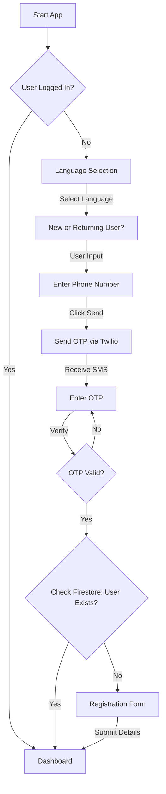
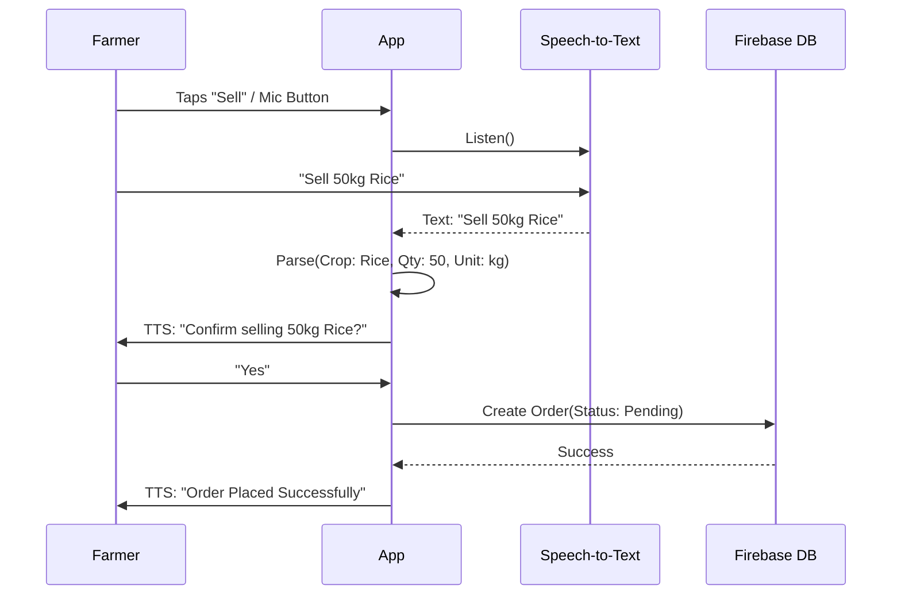
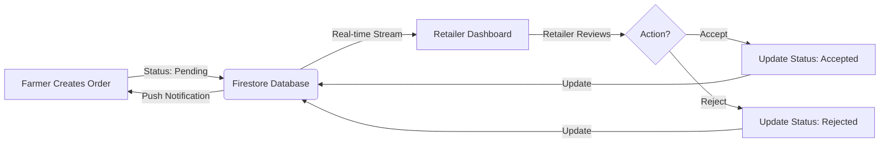
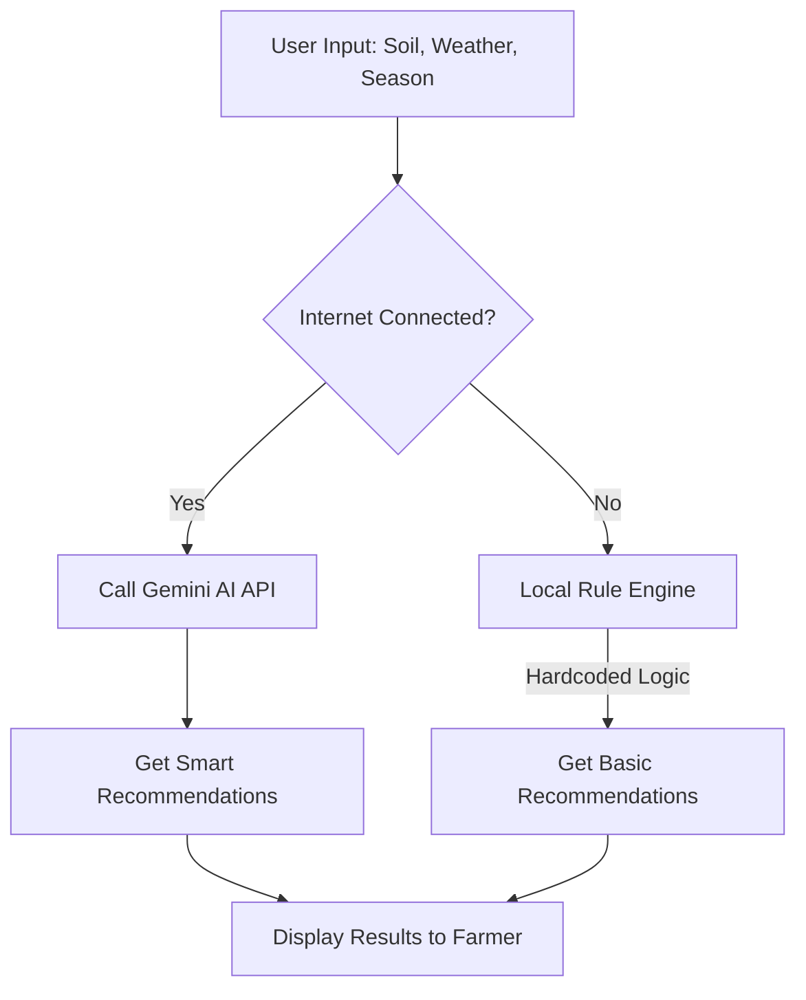

# AgriTrade Application - Comprehensive Overview

## 1. Product Overview

**App Name:** AgriTrade App
**Tagline:** Voice-Powered Agricultural Trading Platform for Farmers and Retailers
**Version:** 1.0.0

AgriTrade is a mobile application designed to bridge the gap between farmers and retailers in the agricultural supply chain using a voice-first, accessible interface. It empowers farmers with low digital literacy to sell their crops effectively while providing retailers with a streamlined procurement process.

---

## 2. Problem Statement

The agricultural sector in developing regions faces several critical challenges that AgriTrade aims to solve:

1.  **Market Access Barriers**: Small-scale farmers often lack access to a wide network of buyers, forcing them to sell to local middlemen at lower prices.
2.  **Information Asymmetry**: Farmers struggle to access real-time market prices and demand trends, putting them at a negotiation disadvantage.
3.  **Digital Divide**: Complex, text-heavy interfaces exclude a significant portion of the farming demographic who may have low literacy or digital skills.
4.  **Fragmented Communication**: Connecting with retailers involves inefficient phone calls and physical visits, leading to time and resource wastage.
5.  **Connectivity Issues**: Rural areas frequently experience poor internet connectivity, rendering many cloud-dependent apps unusable.

---

## 3. Solution & Core Value Proposition

AgriTrade addresses these problems through a **Voice-First, Offline-Capable** mobile platform:

*   **Voice-First Interface**: Supports complete voice interaction in local languages (currently Telugu and English), allowing users to navigate, create orders, and search using speech commands.
*   **Direct Farmer-Retailer Connection**: Eliminates intermediaries by allowing farmers to list crops directly and retailers to browse live inventory.
*   **Accessible Design**: High-contrast UI, large touch targets, and audio feedback ensure usability for all age groups and literacy levels.
*   **Offline Capability**: Critical data (like retailer lists and recent prices) is cached locally, ensuring the app remains functional without active internet.

---

## 4. Key Features

### 🌾 For Farmers
*   **Voice-Guided Order Creation**: "Sell Mode" allows farmers to list crops by simply speaking details (e.g., "Sell 50 kgs of Rice").
*   **Retailer Search**: Find and contact retailers based on location and crop interest.
*   **AI Crop Prediction**: Uses Gemini AI (with local fallback) to recommend optimal crops based on soil type, weather, season, and location.
*   **Market Insights**: Access real-time price trends to decide the best time to sell.

### 🏪 For Retailers
*   **Live Order Stream**: View real-time listings from farmers sorted by recency and location.
*   **Inventory Management**: Track stock levels and manage procurement needs.
*   **Market Analysis**: Dashboard views for price trends and identifying demand gaps.
*   **Order Management**: Accept or reject orders with instant notification to the farmer.

### 🛠️ Shared/Core Features
*   **Multilingual Support**: Instant switching between English and Telugu with localized UI and Voice.
*   **Secure Authentication**: Phone number-based login with OTP verification (via Twilio/Firebase).
*   **Notifications**: Real-time alerts for order status changes (Accepted/Rejected/New Order).
*   **Smart Fallbacks**: AI features gracefully degrade to local logic if connectivity fails.

---

## 5. Technical Architecture

The application follows a clean **Model-View-Service-ViewModel (Provider)** architecture using Flutter for the frontend and Firebase for the backend.

### Tech Stack
*   **Frontend**: Flutter (Dart) - Material 3 Design
*   **Backend**: Firebase (Auth, Firestore, Messaging)
*   **State Management**: Provider Pattern
*   **Voice Services**: `speech_to_text` (STT), `flutter_tts` (TTS)
*   **AI Integration**: Google Gemini API (for advanced crop analysis)
*   **Connectivity**: `connectivity_plus` & `shared_preferences` (Offline sync)

### Data Architecture
*   **Users Collection**: Stores profiles linked to Phone Numbers.
*   **Orders Collection**: Stores crop listings with status (Pending/Accepted/Rejected).
*   **Notifications Collection**: Stores user-specific alerts.

### Security
*   **Auth**: Firebase Phone Auth ensures secure, password-less entry.
*   **Validation**: Rigorous input validation for all forms and voice inputs.
*   **Privacy**: User data is segmented; Farmers only see relevant Retailers and vice-versa.

---

## 6. Key Flow Visualizations

### 🔐 Authentication Flow
This diagram illustrates the secure login process using Phone Authentication and OTP verification.

### 🗣️ Voice Sell Flow (Farmer)
How a farmer creates an order using only voice commands.

### 📦 Order Fulfillment Loop
The lifecycle of an order from creation to retailer action.

### 🌱 AI Crop Prediction Logic
The decision tree for providing crop recommendations.

---

## 7. Current Status & Results

As of the latest build (v1.0.0), the following milestones have been achieved:
*   ✅ **Core Flows Functional**: Registration, Login, Role Selection, and Dashboard navigation are fully operational.
*   ✅ **Voice Integration**: 90%+ accuracy in command recognition for English and Telugu.
*   ✅ **AI Integration**: Crop prediction successfully connects to Gemini API with a robust fallback rule engine.
*   ✅ **Real-time Sync**: Orders appear instantly on Retailer dashboards via Firestore streams.
*   ✅ **Accessibility Compliance**: High contrast modes and large text support are implemented.

---

## 8. Future Sights & Roadmap

The development roadmap focuses on scaling handling and deepening the feature set:

1.  **Payment Gateway Integration**: Enable secure, in-app transactions between farmers and retailers.
2.  **Logistics & Delivery**: Integration with 3rd party logistics to track crop pickup and delivery.
3.  **Expanded Language Support**: Adding Hindi, Kannada, and Tamil to reach a broader user base.
4.  **Advanced AI Vision**: Feature to upload leaf photos for disease detection using on-device ML.
5.  **Offline-Sync 2.0**: Full read-write capability offline with conflict resolution upon reconnection.
6.  **Verified Badge System**: Trust vetting process for retailers to increase farmer confidence.
